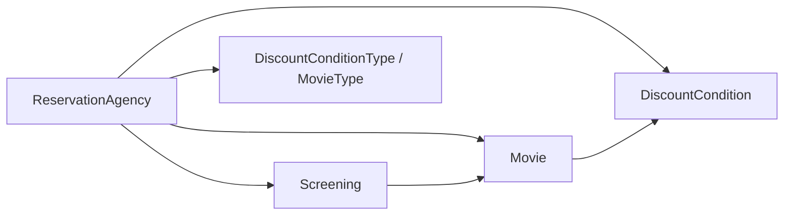
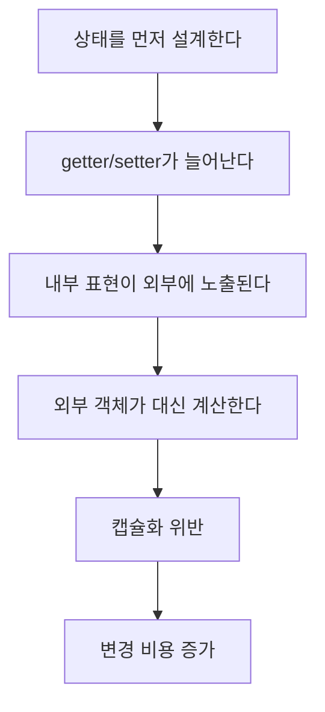
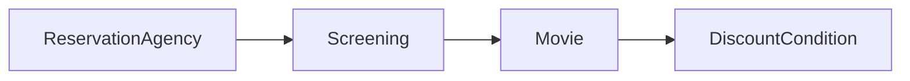

# 오브젝트 4장. 설계 품질과 트레이드오프

> 데이터 중심 설계가 왜 변경에 취약한지 설명하고, 캡슐화, 응집도, 결합도라는 기준으로 더 나은 객체지향 설계를 어떻게 판단할지 정리한다.

## 흐름

1. 설계 품질을 판단하는 기준은 무엇인가
2. 영화 예매 시스템의 데이터 중심 설계는 왜 문제가 되는가
3. 책임을 객체 안으로 이동시키면 무엇이 개선되는가
4. 왜 4장의 결론이 5장 책임 할당하기로 이어지는가

## 요약

- 좋은 설계는 트레이드오프의 결과다.
- 객체지향 설계에서 가장 중요한 기준은 `캡슐화`다.
- `응집도`는 높을수록 좋고, `결합도`는 낮을수록 좋다.
- 데이터 중심 설계는 상태를 먼저 결정하기 때문에 내부 구현이 외부로 새기 쉽다.
- 책임 중심 설계는 객체가 스스로 처리해야 할 행동을 먼저 고민하기 때문에 변경에 더 강하다.

---

## 1. 4장이 말하는 설계 품질

### 핵심 키워드

| 기준 | 의미 | 좋은 설계의 방향 |
| --- | --- | --- |
| 캡슐화 | 변경될 가능성이 높은 구현을 객체 내부로 숨기는 것 | 내부 상태와 구현을 감춘다 |
| 응집도 | 하나의 모듈이 얼마나 하나의 이유로 변경되는가 | 높을수록 좋다 |
| 결합도 | 하나의 모듈이 다른 모듈의 내부에 얼마나 의존하는가 | 낮을수록 좋다 |

### 포인트

- 4장은 "무조건 정답인 구조"를 알려주는 장이 아니다.
- 대신 "좋은 설계를 판단하는 기준"을 알려준다.
- 이후 장들에서 배우는 책임 할당, 메시지, 인터페이스 설계의 기준점이 바로 여기서 나온다.

### 한 문장 정리

> 객체지향 설계의 핵심은 데이터를 나누는 것이 아니라, 변경을 숨기고 책임을 적절히 배치하는 것이다.

---

## 2. 예제: 영화 예매 시스템을 데이터 중심으로 설계하면

4장의 예제는 영화 예매 시스템이다.  
문제는 단순하다.

- 상영 정보를 보고
- 할인 가능 여부를 판단하고
- 최종 예매 금액을 계산한 뒤
- 예약을 생성한다

하지만 이 흐름을 **데이터 중심**으로 풀기 시작하면 설계가 빠르게 흔들린다.

### 예제 코드 위치

- [step01/ReservationAgency.java](../code/movie/step01/ReservationAgency.java)
- [step01/Movie.java](../code/movie/step01/Movie.java)
- [step01/Screening.java](../code/movie/step01/Screening.java)
- [step01/DiscountCondition.java](../code/movie/step01/DiscountCondition.java)

### step01 구조



`ReservationAgency`가 예매 흐름 전체를 통제하고, 나머지 객체는 사실상 데이터 보관소처럼 사용된다.

### step01 코드

```java
public class ReservationAgency {
    public Reservation reserve(Screening screening, Customer customer, int audienceCount) {
        Movie movie = screening.getMovie();

        boolean discountable = false;
        for (DiscountCondition condition : movie.getDiscountConditions()) {
            if (condition.getType() == DiscountConditionType.PERIOD) {
                discountable =
                        screening.getWhenScreened().getDayOfWeek().equals(condition.getDayOfWeek()) &&
                        condition.getStartTime().compareTo(screening.getWhenScreened().toLocalTime()) <= 0 &&
                        condition.getEndTime().compareTo(screening.getWhenScreened().toLocalTime()) >= 0;
            } else {
                discountable = condition.getSequence() == screening.getSequence();
            }
        }

        Money fee = movie.getFee();
        ...
    }
}
```

### 이 코드가 말해주는 것

- `ReservationAgency`가 `Screening`, `Movie`, `DiscountCondition`의 내부 데이터에 직접 접근한다.
- 할인 조건 판단과 금액 계산 정책이 한 메서드에 몰려 있다.
- 객체들이 스스로 일하지 않고, 외부 객체가 대신 판단한다.

즉, **객체는 많은데 객체지향적이지는 않은 구조**다.

---

## 3. 데이터 중심 설계의 첫 번째 문제: 캡슐화 위반

데이터 중심 설계는 보통 이런 순서로 시작한다.

1. 어떤 데이터를 저장해야 하지?
2. 그 데이터를 조회할 getter/setter가 필요하겠지?
3. 실제 계산은 서비스 객체가 하면 되겠지?

이 접근의 문제는, 객체의 내부 표현이 인터페이스 바깥으로 새어나온다는 점이다.

### 캡슐화가 깨지는 순간

```java
public class DiscountCondition {
    private DiscountConditionType type;
    private int sequence;
    private DayOfWeek dayOfWeek;
    private LocalTime startTime;
    private LocalTime endTime;

    public DiscountConditionType getType() { ... }
    public int getSequence() { ... }
    public DayOfWeek getDayOfWeek() { ... }
    public LocalTime getStartTime() { ... }
    public LocalTime getEndTime() { ... }
}
```

외부 객체가 이 데이터를 모두 알아야만 할인 여부를 계산할 수 있다면, `DiscountCondition`은 자신의 책임을 잃어버린다.

- getter가 문제의 본질은 아니다.
- **getter에 의존해서 외부가 내부 규칙을 대신 판단하는 상황**이 문제다.
- 내부 구현이 바뀌면 외부 로직도 함께 바뀌므로 변경 파급이 커진다.

### 그림으로 보기



---

## 4. 두 번째 문제: 높은 결합도

결합도는 "한 객체가 다른 객체의 내부에 얼마나 많이 기대고 있는가"를 보여준다.

`step01`의 `ReservationAgency`는 다음 정보를 모두 알고 있다.

- 상영 시간
- 상영 순번
- 할인 조건 종류
- 할인 조건의 요일/시간
- 할인 금액 정책
- 할인 비율 정책
- 영화 타입

### 왜 높은 결합도인가

- 할인 조건 타입이 바뀌면 `ReservationAgency`를 수정해야 한다.
- 금액 계산 방식이 바뀌어도 `ReservationAgency`를 수정해야 한다.
- `Movie`, `Screening`, `DiscountCondition`의 내부 구조가 바뀌면 역시 `ReservationAgency`를 수정해야 한다.

즉, 하나의 객체가 다른 여러 객체의 세부사항에 과도하게 결합되어 있다.

> `ReservationAgency`는 예매를 "조정"하는 객체가 아니라, 시스템 전체 규칙을 혼자 떠안은 객체가 되어 버렸다.

---

## 5. 세 번째 문제: 낮은 응집도

응집도가 낮다는 말은, 하나의 모듈이 너무 많은 이유로 변경된다는 뜻이다.

`ReservationAgency`는 다음 사유로 변경될 수 있다.

- 할인 조건이 추가될 때
- 할인 조건 판단 방식이 바뀔 때
- 할인 금액 계산 방식이 바뀔 때
- 영화 정책 종류가 바뀔 때
- 예매 금액 계산 규칙이 바뀔 때

이 정도면 "예매 대행"이라는 하나의 책임을 가진 것이 아니라, 여러 정책을 한데 뭉쳐 둔 것이다.

### 응집도가 낮을 때 생기는 문제

- 관련 없는 변경이 같은 파일에 모인다.
- 하나의 정책을 수정해도 다른 로직을 건드릴 가능성이 커진다.
- 테스트 범위가 불필요하게 넓어진다.

---

## 6. 개선 방향: 스스로 자신의 데이터를 책임지는 객체

4장은 이 지점에서 중요한 방향을 제시한다.

> 객체는 단순한 데이터 묶음이 아니라, 자신의 상태를 스스로 책임지는 자율적인 존재여야 한다.

즉, 책임을 외부 서비스 객체에 몰아넣지 말고 데이터와 가까운 객체 안으로 이동시켜야 한다.

### step02 코드 위치

- [step02/ReservationAgency.java](../code/movie/step02/ReservationAgency.java)
- [step02/Screening.java](../code/movie/step02/Screening.java)
- [step02/Movie.java](../code/movie/step02/Movie.java)
- [step02/DiscountCondition.java](../code/movie/step02/DiscountCondition.java)

### step02 구조



로직이 `ReservationAgency` 하나에 몰리지 않고, 관련 데이터를 가진 객체 쪽으로 일부 이동했다.

### step02 코드

```java
public class ReservationAgency {
    public Reservation reserve(Screening screening, Customer customer, int audienceCount) {
        Money fee = screening.calculateFee(audienceCount);
        return new Reservation(customer, screening, fee, audienceCount);
    }
}
```

```java
public class Screening {
    public Money calculateFee(int audienceCount) {
        switch (movie.getMovieType()) {
            case AMOUNT_DISCOUNT:
                if (movie.isDiscountable(whenScreened, sequence)) {
                    return movie.calculateAmountDiscountedFee().times(audienceCount);
                }
            ...
        }
        return movie.calculateNoneDiscountedFee().times(audienceCount);
    }
}
```

### 무엇이 좋아졌는가

- 예매 대행 객체가 세부 규칙을 덜 안다.
- 금액 계산 책임이 `Screening`, `Movie`, `DiscountCondition`으로 분산된다.
- 데이터와 행동이 조금 더 가까워졌다.

이것만으로도 `step01`보다는 확실히 낫다.

---

## 7. 그런데 step02도 완전한 해답은 아니다

4장의 중요한 포인트는, **단순히 책임을 조금 옮겼다고 해서 설계가 완성되지는 않는다**는 점이다.

### step02에 남아 있는 문제

#### 1. 타입 코드에 의존한다

```java
switch (movie.getMovieType()) {
    case AMOUNT_DISCOUNT:
    case PERCENT_DISCOUNT:
    case NONE_DISCOUNT:
}
```

- `Screening`이 여전히 `Movie`의 종류를 알아야 한다.
- 새 정책이 추가되면 `switch`가 또 수정된다.

#### 2. 내부 데이터를 판단용 파라미터로 노출한다

```java
movie.isDiscountable(whenScreened, sequence)
```

- `Movie`가 할인 가능 여부를 계산하기 위해 `whenScreened`, `sequence`를 넘겨받는다.
- 완전히 메시지 중심으로 협력한다기보다, 아직도 데이터 전달의 흔적이 남아 있다.
- Movie가 판단에 필요한 정보를 외부에서 받아야 한다는 것 자체가 Movie 내부 상태 설계가 충분히 자율적이지 않다는 신호

#### 3. `DiscountCondition`도 타입 분기를 가진다

```java
if (condition.getType() == DiscountConditionType.PERIOD) {
    ...
} else {
    ...
}
```

- 조건 객체 내부에서도 타입 코드 분기가 남아 있다.
- 즉, 캡슐화가 개선되었지만 충분하지는 않다.

### 포인트

- `step02`는 목적지가 아니라 과도기다.
- 4장의 진짜 결론은 "책임을 옮겨 보니 왜 더 나아지는지"를 체감하는 데 있다.
- 이 문제의 본격적인 해법이 다음 장 `책임 할당하기`로 이어진다.

---

## 8. 데이터 중심 설계 vs 책임 중심 설계

| 비교 항목 | 데이터 중심 설계 | 책임 중심 설계 |
| --- | --- | --- |
| 출발점 | 어떤 데이터를 저장할까 | 어떤 행동을 책임져야 할까 |
| 객체의 역할 | 데이터 보관소 | 자율적인 협력자 |
| 인터페이스 | 상태 노출 중심 | 메시지 중심 |
| 변경 영향 | 외부로 전파되기 쉽다 | 내부에서 흡수되기 쉽다 |
| 결과 | 낮은 응집도, 높은 결합도 | 높은 응집도, 낮은 결합도에 가까워짐 |

### 결론

> 객체지향 설계는 데이터를 클래스로 나누는 일이 아니라, 책임이 자연스럽게 흘러가도록 협력을 설계하는 일이다.

---

## 9. 정리

### Q1. getter/setter를 쓰면 무조건 나쁜가?

- 아니다.
- 문제는 getter/setter의 존재가 아니라, **그 결과로 외부 객체가 내부 규칙을 대신 판단하는 구조**다.

### Q2. 왜 캡슐화가 제일 중요한가?

- 응집도와 결합도는 결국 캡슐화가 잘 되었는지의 결과로 나타나는 경우가 많다.
- 내부 구현을 숨기면 외부 의존이 줄고, 관련 책임이 내부로 모여 응집도가 높아진다.

### Q3. 결론

- 상태보다 행동을 먼저 보고, 데이터보다 책임을 먼저 보자.

---

## 10. 마무리

4장은 좋은 설계를 외형으로 판별하는 장이 아니다.  
대신 변경에 강한 설계를 판단하는 기준을 제공한다.  
영화 예매 예제에서 보듯이 데이터 중심 설계는 빠르게 캡슐화를 무너뜨리고, 높은 결합도와 낮은 응집도로 이어진다.  
반대로 책임을 객체 안으로 이동시키기 시작하면 객체는 자율성을 얻고 협력 구조도 자연스러워진다.  
그래서 다음 단계는 "누가 이 책임을 가져야 하는가"를 묻는 책임 할당이다.

---

## 11. 예제 코드 흐름

- [step01/ReservationAgency.java](../code/movie/step01/ReservationAgency.java): 데이터 중심 설계의 문제를 가장 잘 보여주는 코드
- [step01/Movie.java](../code/movie/step01/Movie.java): 다수의 getter/setter와 타입 코드 노출
- [step02/ReservationAgency.java](../code/movie/step02/ReservationAgency.java): 책임 이동의 첫 단계
- [step02/Screening.java](../code/movie/step02/Screening.java): 계산 책임이 이동한 지점
- [step02/DiscountCondition.java](../code/movie/step02/DiscountCondition.java): 조건 판단 책임이 일부 이동한 코드