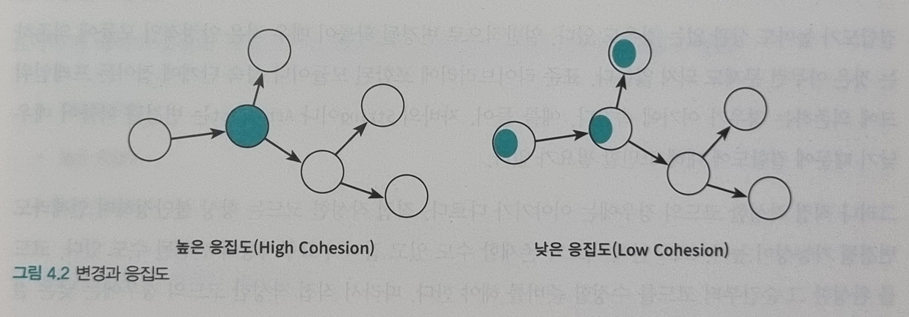
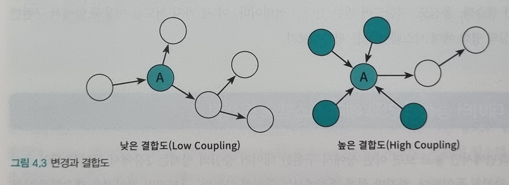
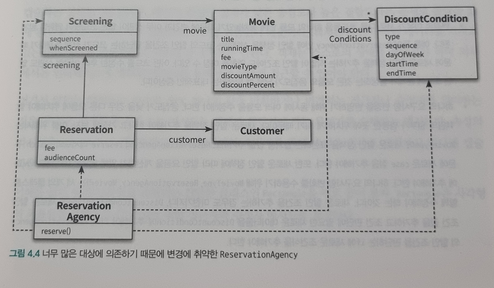
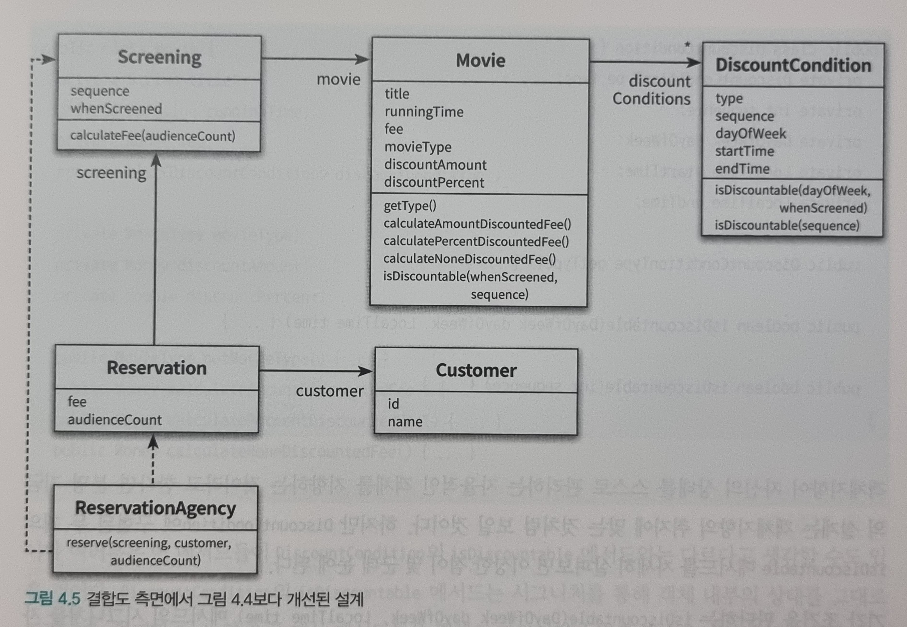

# 04장 설계 품질과 트레이드 오프

- 객체지향 설계의 핵심은 협력, 책임, 역할이다.
    - 협력은 애플리케이션의 기능을 구현하기 위해 메시지를 주고받는 객체들 사이의 상호작용이다.
    - 책임은 객체가 다른 객체와 협력하기 위해 수행하는 행동
    - 역할은 대체 가능한 책임의 집합
    - 객체지향은 `책임`이 중요
- 객체지향설계란 올바른 객체에게 올바른 책임을 할당하면서 낮은 결합도와 높은 응집도를 가진 구조를 창조하는 활동
    - 첫번째 관점: 객체지향 설계의 핵심이 책임이라는 것
    - 두번째 관점: 책임을 할당하는 작업이 응집도와 결합도 같은 설계 품질과 깊이 연관돼 있다는 것
- 훌륭한 설계란 합리적인 비용 안에서 변경을 수용할 수 있는 구조를 만드는 것
    - 느슨한 결합, 응집도가 높은 요소로 구성

## 01. 데이터 중심의 영화 예매 시스템

- 시스템을 객체로 분할
    1. 상태를 분할의 축으로 (데이터 중심 설계)
        - 객체 자신이 포함하고 있는 데이터를 조작하는 데 필요한 오퍼레이션을 정의
    2. 책임을 분할의 축으로 (책임 중심 설계)
        - 객체는 다른 객체가 요청할 수 있는 오퍼레이션을 위해 필요한 상태를 보관
- 데이터중심 설계의 경우
    - 더 직관적인거같다.
    - 정량할인, 정률할인의 필드를 둘 다 가질 필요가 없는데 가지게된다. (조건도 마찬가지. 순번, 기간에 관련한 정보를 다 가지게된다.)
- 객체의 상태: 객체가 저장해야 하는 데이터의 집합(상태 = 데이터). 객체의 상태는 구현에 속한다.
- 객체의 상태는 구현에 속한다
    - 구현은 불안정하기 때문에 변화가 쉽다.
    - 상태를 객체 분할의 중심축으로 삼으면 구현에 관한 세부사항이 객체의 인스턴스에 스며들게 되어 캡슐화의 원칙이 무너진다.
    - 상태 변경 → 인터페이스의 변경을 초래 → 인터페이스에 의존하는 모든 객체에게 변경의 영향이 퍼짐
    - 따라서 변화에 취약
- 객체의 책임은 인터페이스에 속한다.
    - 책임을 드러내는 안정적인 인터페이스 뒤로 책임을 수행하는 데 필요한 상태를 캡슐화 → 구현 변경에 대한 파장이 외부로 퍼져나가는 것을 방지
    - 따라서 책임에 초점을 맞추면 상대적으로 변경에 안정적인 설계를 얻을 수 있다.

## 02. 설계 트레이드오프

### 캡슐화

- 캡슐화: 변경가능성이 높은 부분을 객체 내부로 숨기는 추상화 기법
- 복잡성을 취급하는 주요한 추상화 방법은 캡슐화
- 객체지향 프로그래밍을 통해 전반적으로 얻을 수 있는 장점은 오직 설계 과정 동안 캡슐화를 목표로 인식할때만 달성될 수 있다.
- 유지보수성이 목표다. 유지보수성이란 두려움 없이, 주저함 없이, 저항감 없이 코드를 변경할 수 있는 능력을 말한다.

### 응집도와 결합도
| 응집도 | 결합도 |   
|---|---|   
||  |

- 응집도와 결합도는 구조적 설계 방법이 주도하던 시대에 소프트웨어 품질을 측정하기 위해 소개된 기준이지만 객체지향 시대에 여전히 유효
- 응집도: 모듈에 포함된 내부 요소들이 연관돼 있는 정도를 나타냄
    - 응집도가 높을수록 좋다
    - 변경의 관점에서 응집도란 변경이 발생할 때 모듈 내부에서 발생하는 변경의 정도로 측정
- 결합도: 의존성의 정도를 나타내며 다른 모듈에 대해 얼마나 많은 지식을 갖고 있는 척도
    - 어떤 모듈이 다른 모듈에 대해 너무 자세한 부분까지 알고 있다면 높은 결합도를 가짐
    - 결합도가 낮을수록 좋음
    - 한 모듈이 변경되기 위해서 다른 모듈의 변경을 요구하는 정도로 측정

## 03. 데이터 중심의 영화 예매 시스템의 문제점

### 캡슐화 위반

- 데이터 중심으로 설계한 클래스를 보면 객체 내부 상태에 get-set을 통해 간접적으로 접근할 수 있음
- 이는 캡슐화 원칙을 지키고 있는 것처럼 보이지만 아님
    - 해당 이름의 인스턴스 변수가 존재한다는 사실을 퍼블릭 인터페이스에 노골적으로 드러냄
    - `추측에 의한 설계 전략 (design-by-guessing straegy)`: 접근자와 수정자에게 과도하게 의존하는 설계 방식

### 높은 결합도

- 구현이 객체의 인터페이스에 드러난다는 것은 클라이언트가 구현에 강하게 결합된다는 것을 의미

```java
public class ReservationAgency {
    public Reservation reserve(Screening screening, Customer customer,
                               int audienceCount) {
		...
        Money fee;
        if (discountable) {
			...
            fee = movie.getFee().minus(discountAmount).times(audienceCount);
        } else {
            fee = movie.getFee().times(audienceCount);
        }

        return new Reservation(customer, screening, fee, audienceCount);
    }
}
```

- 데이터 중심의 영화 시스템을 보면 대부분의 제어 로직을 가지고 있는 ReservationAgency가 모든 객체 데이터에 의존한다.
- 만약 DiscountCondition, Screening 중 어느것을 수종해도 ReservationAgency도 함께 수정해야한다.
- **ReservationAgency는 모든 의존성이 모이는 결합의 집결지**이다.

### 낮은 응집도

- 서로 다른 이유로 변경되는 코드가 하나의 모듈 안에 공존할 때 응집도가 낮다고 말함
- 단일 책임 원칙(Single Responsiblility Principle, SRP)
    - 모듈의 응집도가 변경과 연관이 있다는 사실을 강조하기 위해 단일 책임 원칙이라고 설계 원칙을 제시
    - 클래스는 단 하나의 변경 이유만 가져야 한다.
- ReservationAgency는 다음과 같은 수정사항이 발생하는 경우에 코드를 수정해야 한다.
    - 할인 정책이 추가되는 경우
    - 할인 정책별로 할인 요금을 계산하는 방법이 변경될 경우
    - 할인 조건이 추가되는 경우
    - 할인 조건별로 할인 여부를 판단하는 방법이 변경될 경우
    - 예매 요금을 계산하는 방법이 변경될 경우
- 낮은 응집도는 두가지 측면에서 설계에 문제를 일으킨다.
    1. 변경의 원인이 다른 코드들이 하나의 모듈 안에 뭉쳐있어 변경과 아무 상관 없는 코드들까지 영향을 받는다.
    2. 하나의 요구사항 변경을 위해 여러 모듈을 수정해야 한다. 

## 04. 자율적인 객체를 향해

### 캡슐화를 지켜라

- 캡슐화는 설계의 제1원리
- Ractangle이 크기를 변경하려고 할 때
    - 코드 중복이 발생한다.
    - 변경에 취약: right, bottom 대신 length, height를 이용해서 사각형을 변경하도록 변경한다면 다른 곳에서 사용한 getRight, setRight ,,,를 모두 변경해야한다.

```java
class Rectangle {
	public void enlarge(int multiple) {
		right *= multiple;
		bottom *= multiple;
	}
}
```

- AnyClass에서 증가시키던 구조에서 자신의 크기를 Rectangle 스스로가 증가시키도록 `책임을 이동` 시킨 것이다. 이것이 객체가 자기 스스로를 책임진다는 말의 의미이다.

### 스스로 자신의 데이터를 책임지는 객체

- 객체는 단순한 데이터 제공자가 아니다. 객체 내부에 저장되는 데이터보다 객체가 협력에 참여하면서 수행할 책임을 정의하는 오퍼레이션이 더 중요하다.

## 05. 하지만 여전히 부족하다

### 캡슐화 위반

- `isDiscountable(DayOfWeek dayOfWeek, LocalTime time)` 메서드의 시그니처에는 DiscountCondition에 속성으로 포함돼있는 DayOfWeek 타입의 요일 정보와 LocalTime타입의 시간 정보를 외부에 노출하고 있다.
- 내부의 변경이 외부로 퍼져나가는 파급효과는 캡슐화가 부족하다는 명백한 증거다
    - 따라서 변경 후의 설계는 자기 자신을 스스로 처리한다는 점에서 이전의 설계보다 분명히 개선됐지만 여전히 내부구현을 캡슐화하는 데는 실패한 것이다.

### 높은 결합도

- 모든 문제의 원인은 캡슐화 원칙을 지키지 않았기 때문이다.
    - 유연한 설계를 창조하기 위해서는 캡슐화를 설계의 첫 번째 목표로 삼아야 한다.

### 낮은 응집도

- 응집도가 낮은 이유는 캡슐화를 위반했기 때문이다.

## 06. 데이터 중심 설계의 문제점

- 캡슐화를 위반한 설계를 구성하는 요소들이 높은 응집도와 낮은 결합도를 가질 확률은 극히 낮다.
    - 따라서 캡슐화를 위반한 설계는 변경에 취약할 수 밖에 없다.
- 데이터 중심의 설계가 변경에 취약한 이유
    - 데이터 중심의 설계는 본질적으로 너무 이른 시기에 데이터에 관해 결정하도록 강요한다.
    - 데이터 중심의 설계에서는 협력이라는 문맥을 고려하지 않고 객체를 고립시킨 채 오퍼레이션을 결정한다.

### 데이터 중심 설계는 객체의 행동보다는 상태에 초점을 맞춘다

- 데이터는 구현의 일부라는 사실을 명심하라.
    - 데이터 주도 설계는 설계를 시작하는 처음부터 데이터에 관해 결정하도록 강요하기 때문에 너무 이른 시기에 내부 구현에 초점을 맞추게 한다.
- 데이터 중심의 관점에서 객체는 그저 단순한 데이터의 집합체일 뿐이다.
    - 이로 인해 접근자와 수정자를 과도하게 추가하게 되고 이 데이터 객체를 사용하는 절차를 분리된 별도의 객체 안에 구현하게 된다.
- 데이터를 처리하는 작업과 데이터를 같은 객체 안에 두더라도 데이터에 초점이 맞춰져 있다면 만족스러운 캡슐화를 얻기 어렵다.
    - 데이터를 먼저 결정하고 데이터를 처리하는 데 필요한 오퍼레이션을 나중에 결정하는 방식은 데이터에 관한 지식이 객체의 인터페이스에 고스란히 드러나게 된다.
    - 결과적으로 객체의 인터페이스는 구현을 캡슐화하는 데 실패하고 코드는 변경에 취약해진다.

### 데이터 중심 설계는 객체를 고립시킨 채 오퍼레이션을 정의하도록 만든다

- 데이터 중심 설계에서 초점은 객체의 외부가 아니라 내부로 향한다
    - 실행 문맥에 대한 깊이 있는 고민 없이 객체가 관리할 데이터의 세부 정보를 먼저 결정한다.
    - 객체의 구현이 이미 결정된 상태에서 다른 객체와의 협력 방법을 고민하기 때문에 이미 구현된 객체에 인터페이스를 억지로 끼워 맞출 수밖에 없다.
- 객체의 인터페이스에 구현이 노출돼 있었기 때문에 협력이 구현 세부사항에 종속돼 있고 그에 따라 객체의 내부 구현이 변경되었을 때 협력하는 객체 모두가 영향을 받을 수 밖에 없었던 것이다.